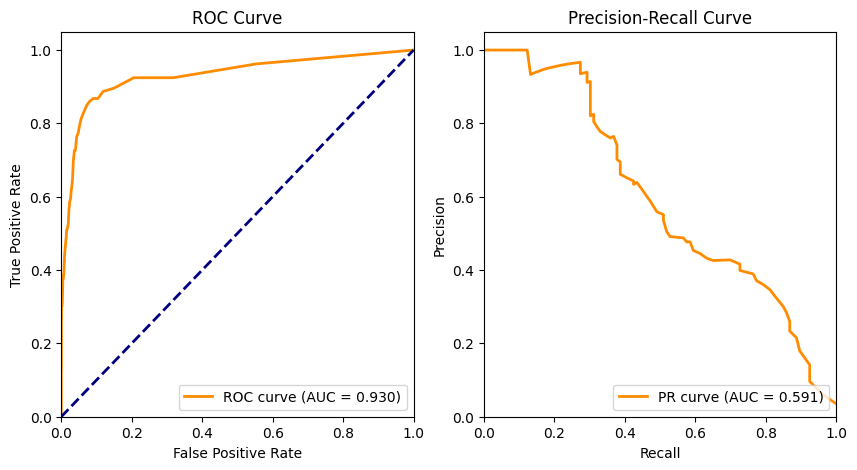
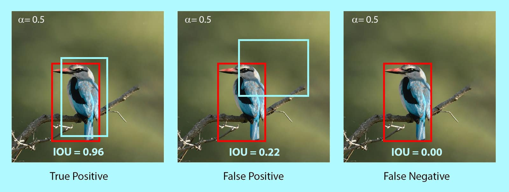

# Calculated metrics
- **ROC Curve** - shows TRP/FPR under different **confidence** intervals. shows how good model classifies. below 0.5 - no difference from random guessing.
- **P/R Curve** - shows Precision/Recall under different **confidence** intervals. Similar to ROC, good for imbalanced datasets.
 

- **Screw up images** - shows images with bad IOU's between ground truth and predictions from the model. Helps evaluating errors.
 
